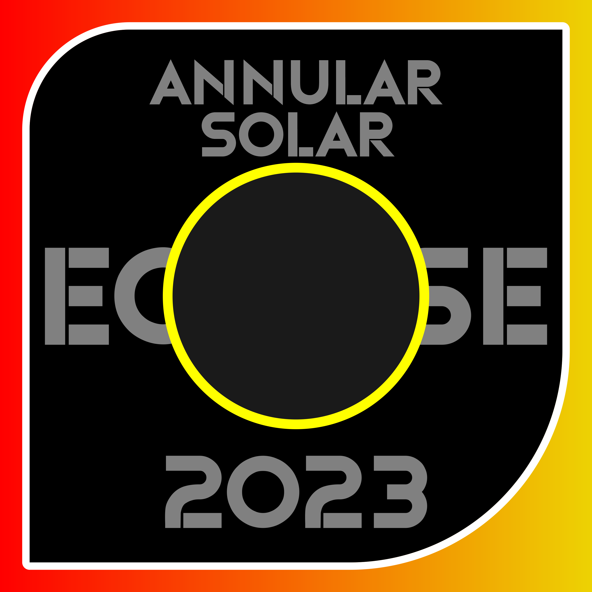

# 🟢 Eclipse Solar Anular 2023

En este proyecto, me propuse investigar las variaciones en la luz y la temperatura durante un eclipse solar anular. Este fenómeno se produce cuando la Luna se interpone entre el Sol y la Tierra, proyectando su sombra parcial sobre nuestro planeta. Para lograr esto, utilicé un sensor de temperatura para medir la temperatura ambiente, una pantalla LCD para visualizar los datos, y un microcontrolador que actuó como el cerebro de los componentes.

## Durante el Ensamblaje del Circuito
- Seguí transmisiones en vivo de la NASA y otras fuentes para obtener información en tiempo real.

## Resultados
Los resultados que obtuve son los siguientes:
- La intensidad de la luz disminuyó de manera no tan drástica, pero se pudo observar una luz amarillenta algo oscura o no tan brillante.
- La temperatura también descendió, lo cual fue más notable, ya que no se sentía el calor del sol, sino solo la luz visible.
- La pantalla LCD mostró los valores de luz y temperatura en tiempo real durante todo el eclipse solar anular, lo que permitió visualizar las variaciones que se produjeron.

Elaboré un documento de Excel con estos datos, que contiene gráficos e imágenes que ilustran las diferencias en la luz y la temperatura antes, durante y después del eclipse solar anular.

---

© 2023. Todos los códigos e imágenes dentro de este repositorio han sido creados por mí. Todos los derechos reservados.
